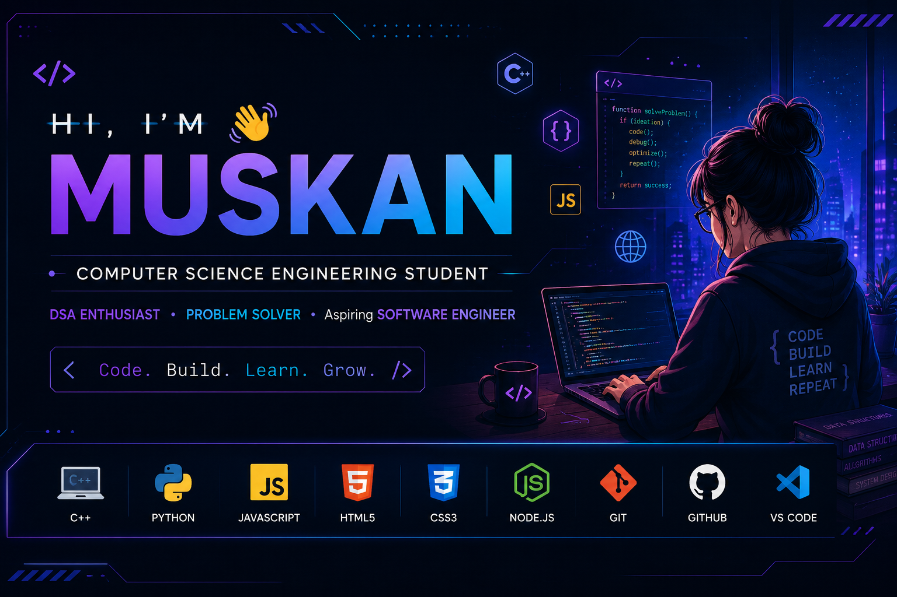

<p align="center">
  
</p>

# 👋 Hi, I'm Muskan

### 💻 Computer Science Engineering Student

# 👋 Hi, I'm Muskan

### 💻 Computer Science Engineering Student

I'm a CSE student who enjoys **coding, problem solving, and building things**.

Currently focused on strengthening my programming fundamentals, improving my DSA skills, and learning modern web development.

---

## ⚡ What I'm Learning

* 🧠 Data Structures & Algorithms with C++
* 🌐 JavaScript & Web Development
* ⚙️ Node.js & Backend Development
* 🐍 Python
* 🐙 Git & GitHub

---

## 🛠️ Tech Stack

### 👨‍💻 Languages

* C++
* Python
* JavaScript

### 🌐 Web Development

* HTML5
* CSS3
* JavaScript
* Node.js

### 🧰 Tools

* Git
* GitHub
* VS Code

---

## 🧠 Problem Solving

I regularly practice **Data Structures & Algorithms in C++** to improve my problem-solving and logical thinking.

### 📌 Currently Working On

`Arrays` • `Strings` • `Linked List` • `Stack` • `Queue` • `Binary Search` • `Trees` • `Graphs` • `DP`

---

## 🌱 Currently

```text
Learning      → DSA + Web Development
Building      → Small projects & experiments
Improving     → Problem Solving + Programming Fundamentals
Exploring     → Software Development
```

---

## 📊 Coding Profiles

### 🟠 LeetCode

🔗 [MUSKAN_CHAUHAN_1123](https://leetcode.com/u/MUSKAN_CHAUHAN_1123/)

### 🏆 CodeChef

🔗 [acute_gale_23](https://www.codechef.com/users/acute_gale_23)

---

## 📈 GitHub

I use GitHub to document my learning, practice coding, and build projects.

---

### ✨ Learning → Building → Improving

⭐ *Consistency beats intensity. Keep coding every day.*
